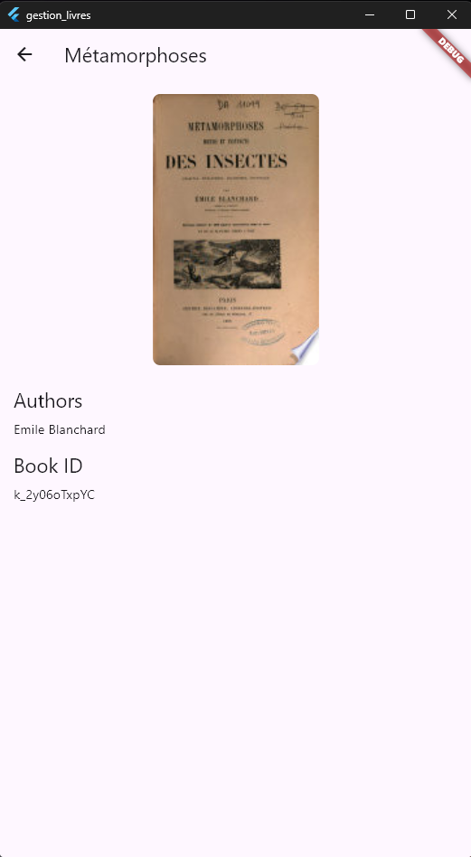

# gestion_livres

A Simple Flutter Book Management App.

## Overview

**gestion_livres** is a Flutter application that allows users to:

- Search for books via the Google Books API.
- View detailed information about selected books.
- Mark books as favorites and view them in a dedicated favorites tab.

## Features

- **Book Search:** Search for books using a search bar. Results are displayed with book images and authors.
- **Book Details:** Clicking on a book shows a detailed page with book cover, title, authors, and additional information.
- **Favorites:** Easily add or remove books from your favorites, which are stored locally using SQLite.

## Project Structure

- **main.dart** – Application entry point.
- **models/**
  - **book.dart** – Defines the `Book` model with properties such as `id`, `title`, `authors`, and `imageUrl`.
- **pages/**
  - **home.page.dart** – Contains the search functionality and displays search results using `BookTile`.
  - **detail.page.dart** – Displays detailed information about a selected book.
  - **favorites.page.dart** – Lists favorite books stored in the local database.
- **services/**
  - **api.service.dart** – Handles API calls to the Google Books API.
  - **db.service.dart** – Manages the SQLite database for storing favorite books.
- **screenshots/**
  - **search.png** – Screenshot of the book search interface.
  - **idle.png** – Screenshot when no search results are shown.
  - **details.png** – Screenshot of the book details page.
  - **favorite.png** – Screenshot of the favorites page.

## Setup and Installation

1. **Clone the repository:**

   ```bash
   git clone <repository_url>
   cd gestion_livres
   ```

2. **Install the dependencies:**

   ```bash
   flutter pub get
   ```

3. **Run the application:**
   ```bash
   flutter run
   ```

## Database Configuration

This project uses the `sqflite` package for local storage. The database is initialized in `db.service.dart` and creates a favorites table during the first run. Ensure that your device or emulator supports SQLite operations.

## Screenshots

### Search Screen


### Idle State


### Book Detail



### Favorites


